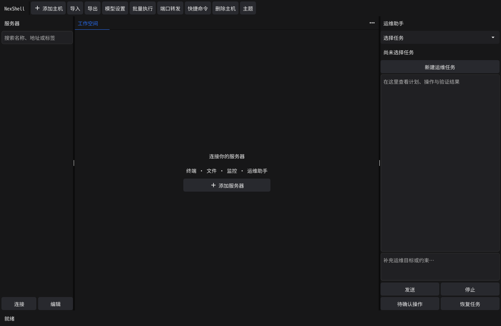

# NexShell

> 面向运维人员的原生 Go SSH 工作台，结合任务授权的 AI 服务器运维助手。
>
> A native Go desktop SSH workbench with task-scoped AI operations.

[](https://github.com/GHOSTEDDIE/NexShell/actions/workflows/ci.yml)
[](LICENSE)
[](go.mod)



NexShell 是一个面向个人运维和开发团队的跨平台桌面 SSH 客户端。它把终端、文件、监控、端口转发、文件传输和任务助手放在同一个工作台中，并将 AI 的每次远程操作绑定到明确的服务器、操作类型、资源范围和验证证据。

项目当前处于 **0.1 开发阶段**。核心流程已有本地回归、隔离 Linux SSH 集成测试和 macOS 实机启动验证；正式生产使用前仍需结合目标平台、服务器环境和真实模型进行验收。

## 主要能力

### SSH 工作台

- 密码、私钥、系统 SSH Agent 和交互认证
- 首次连接指纹核对；服务器密钥变化时阻断连接
- 多标签终端、分屏工作区和同一连接下的终端/文件/监控视图
- 跳板机、端口转发、网络诊断、磁盘/进程/端口信息
- 快捷命令、命令历史和可配置的界面主题

### 文件与传输

- SFTP 文件浏览、下载、上传、续传和传输取消
- 文件保存前校验读取时哈希，支持备份和原子覆盖
- 内置 Go ZMODEM，支持与远端 `rz` / `sz` 互通，无需客户端安装 `lrzsz`
- 对话框支持添加本地文件、粘贴文件路径和拖入附件
- 部署包上传前展示源文件、目标服务器、目标路径、覆盖方式和 SHA-256；上传后再次读取远端文件独立校验

### AI 运维助手

- 基于 Eino DeepAgent 的计划、执行和验证流程
- 每项变更绑定目标服务器、操作类型、精确资源和有效期
- Shell、文件修改、服务重启、软件包安装等变更操作需要明确确认
- 支持单层运维子 Agent、内置 Skills 和按服务器隔离的自动记忆
- 记录计划、子任务、审批、执行结果、验证证据和未知状态
- 中断、断线或退出时不会自动重放结果未知的远程变更

### 本地安全边界

- SSH 密码、私钥口令和模型密钥存入系统凭据库
- 主机配置、任务、审批、执行记录和检查点保存在本地 SQLite
- 主机 JSON 导出不包含凭据，但可能包含服务器地址、账号和私钥路径
- 本地文件读取只开放用户明确添加的文件或授权目录，不提供本机通用 Shell
- 当前版本不包含远程桌面、云同步、常驻远程执行服务或外部 MCP 接入

## 快速开始

### 环境要求

- Go 1.25
- C 编译器
- 图形开发依赖：
  - macOS：Xcode Command Line Tools
  - Windows：GCC/MinGW
  - Linux：OpenGL、X11、Wayland 和 xkbcommon 开发库

### 从源码运行

```sh
git clone https://github.com/GHOSTEDDIE/NexShell.git
cd NexShell

# 使用独立数据目录启动，避免影响本机已有配置
go run ./cmd/nexshell -data-dir /tmp/nexshell-dev
```

不传 `-data-dir` 时，应用会使用系统用户配置目录下的 `NexShell` 目录。

首次使用时，在“连接列表”中添加服务器；在“设置”中配置 OpenAI 兼容模型或 Ollama。只使用 SSH 工作台时不需要先配置模型。

### 构建应用

```sh
go build ./cmd/nexshell
bash scripts/package.sh
```

打包脚本按当前主机系统生成 `dist/` 产物：macOS 应用压缩包、Linux tar.gz 和 Windows GUI 可执行文件。macOS 应用包包含 NexShell 应用图标；代码签名和公证需要在发布环境中另行配置。

## 开发与测试

运行完整的本地回归：

```sh
go test -race -tags ci ./...
go vet -tags ci ./...
```

运行隔离 Linux SSH 集成测试：

```sh
docker build -t nexshell-test-sshd:local tests/fixture
go test -race -tags integration ./tests/integration -v -count=1
```

测试会创建只绑定本机回环地址的临时 SSH 容器，使用临时密码，不挂载宿主目录，结束后清理容器。覆盖首次指纹核对、错误密码、跳板、SFTP 冲突与续传、端口转发、监控、ZMODEM、任务授权和执行验证。

终端依赖包含有记录的局部修复，修改相关代码后还需要运行：

```sh
(cd third_party/vt && go test ./...)
```

GitHub Actions 会在 macOS、Windows 和 Ubuntu 矩阵中执行桌面回归与打包，并单独运行 Linux 集成测试。

## 项目结构

```text
cmd/nexshell/       桌面应用入口和内嵌图标资源
internal/ui/        Fyne 工作台、助手界面和交互组件
internal/terminal/  终端网格、输入、颜色和输出处理
internal/remote/    SSH、SFTP、跳板、监控、转发和远程执行
internal/transfer/  ZMODEM 与传输路由
internal/agent/     DeepAgent、Skills、审批、记忆和验证
internal/store/     SQLite 持久化和系统凭据库
tests/              隔离 SSH fixture、单元测试和集成测试
third_party/        带变更记录的终端依赖副本
docs/               架构、能力边界、验证记录和专题说明
```

## 文档

- [架构与执行边界](docs/architecture.md)
- [DeepAgent 运行与迁移说明](docs/deep-agent.md)
- [本地文件与部署包](docs/local-deployment.md)
- [验证记录与已知限制](docs/validation.md)
- [窗口生命周期](docs/macos-window-lifecycle.md)
- [贡献指南](CONTRIBUTING.md)

## 当前限制

- Windows/Linux 安装包、不同图形驱动、输入法候选窗口、多显示器和不同缩放比例仍需目标平台实机验收。
- 真实模型的诊断、修复和验证效果不由确定性测试保证；真实模型测试需要显式授权并使用隔离环境。
- SFTP 在线编辑限制为 4 MiB；大文件应先下载。远程校验和原子替换不等同于跨客户端文件锁。
- ZMODEM 当前不实现超过 4 GiB 的扩展协议，高时延链路吞吐仍未专项调优。
- 本地审计记录不是不可篡改的合规审计归档，也不提供团队协作权限系统。

## 贡献

欢迎提交 Issue 和 Pull Request。提交代码前请：

1. 先阅读相关实现和文档，确认行为边界。
2. 对新增或修复的逻辑补充回归测试。
3. 对 Go 文件运行 `gofmt`，并执行相关单元测试；涉及终端依赖时同时运行 `third_party/vt` 测试。
4. 在 Pull Request 中说明问题、行为变化、验证命令和未覆盖的平台。

## 许可证

NexShell 使用 [Apache License 2.0](LICENSE)。第三方依赖及内置字体的许可信息见 [第三方许可清单](docs/THIRD_PARTY_LICENSES.txt) 和各依赖目录中的许可证文件。
