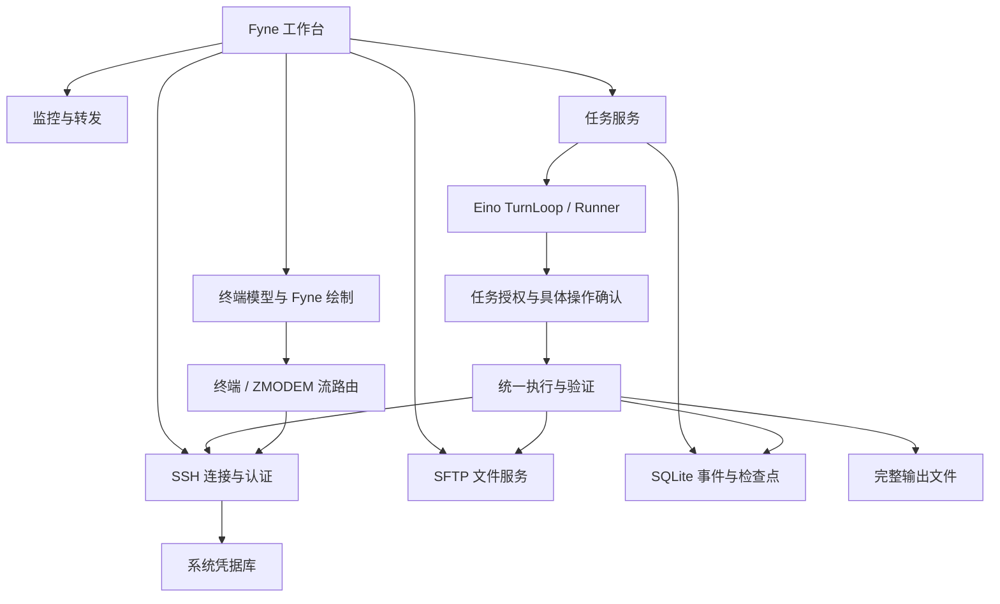

# 架构与调研基线

## 产品依据

- [FinalShell 官方产品页](https://www.hostbuf.com/t/988.html)：SSH 多标签、同屏文件管理、监控和快捷命令作为功能对标。
- [FinalShell 官方常见问题](https://www.hostbuf.com/t/1088.html)：交互通道、执行通道和文件能力要独立呈现错误。
- [Codex 工具调度源码](https://github.com/openai/codex/blob/d6489472f3c15e87d2d7763a5fde033545c530f8/codex-rs/core/src/tools/orchestrator.rs)：借鉴请求绑定、统一授权与执行生命周期，不移植 Rust 实现。
- [Eino Runner](https://github.com/cloudwego/eino/blob/v0.9.13/adk/runner.go)、[TurnLoop](https://github.com/cloudwego/eino/blob/v0.9.13/adk/turn_loop.go)：复用工具循环、流式事件与检查点。
- [Fyne](https://github.com/fyne-io/fyne/tree/v2.8.1)、[终端模型](https://github.com/charmbracelet/x/tree/3986e9119cf98efcf5809969e11ad369fddb5522/vt)：Go 界面与终端协议模型分离。
- [Go SSH](https://pkg.go.dev/golang.org/x/crypto/ssh)、[SFTP](https://github.com/pkg/sftp)、[系统凭据库](https://github.com/zalando/go-keyring)、[SQLite](https://pkg.go.dev/modernc.org/sqlite)。
- [trzsz-go 的 ZMODEM 调用](https://github.com/trzsz/trzsz-go/blob/main/trzsz/zmodem.go)依赖本地进程，因此本项目实现独立的 Go 编解码与协议状态机，以 lrzsz 作互通对端。

## 模块

SQLite 的单写入连接仅用于数据库事务；网络、监控、终端和传输不受单线程限制。多主机连接与批量操作并发运行，冲突变更通过可取消的主机锁排队。

## 执行边界

任务授权绑定主机配置摘要、账号、操作类型、精确资源和有效期。Shell 必须批准具体请求。等待资源锁后再次检查授权，实际连接再次检查主机配置。Agent 文件操作拒绝经符号链接扩大路径范围。

执行请求先写入 SQLite，再接触服务器。任务编号与工具调用编号组成去重键；同编号不同请求被拒绝，已记录的操作不会重复下发。退出状态未知时保留证据并中止自动操作。检查点只能恢复程序状态，不能证明远端进程已经终止。

授权状态不来自模型摘要。工具结果只保留有限的上下文副本，完整输出按执行编号保存，读取证据必须属于当前任务。本地手册按需加载并检查实际路径。

SSH 账号权限是远端执行的实际权限。客户端工具授权不是服务器上的进程或文件沙箱。应用不会自动换用 root 或添加 sudo。

## 终端局部修复

终端模型的固定版本把每次 `Write` 末尾当作字素结束，分开的 `e` 和组合音标会变成独立零宽单元格。补丁在字素写入时检查是否能够扩展前一单元格，保留字符宽度和样式。上游代码、许可证和原有测试保存在 `third_party/vt`，补丁说明与其同目录保存。

## 存储

默认目录为系统用户配置目录下的 NexShell。`state.db` 保存主机配置、模型配置、任务、操作批准、消息历史、事件、执行记录与检查点；`known_hosts` 保存本应用核实过的服务器身份；`artifacts` 保存执行输出。登录密码、私钥口令和模型 API 密钥只在系统凭据库中保存。

主机 JSON 导出不携带凭据，但包含服务器地址、账号和私钥路径，应按自身运维资料管理。应用本地数据不是加密审计归档，也不提供多人权限系统。
